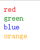
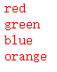
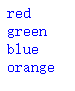
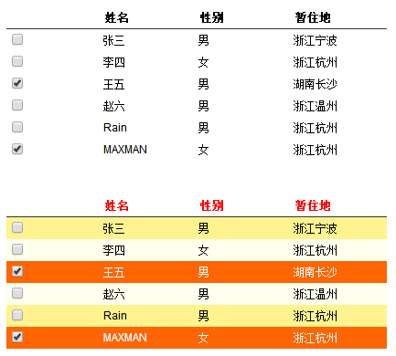
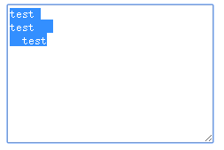

 # plugin
 ##### color()插件，获取和设置颜色 --（封装jQuery对象方法的插件）
 
 
 
 ##### 表格隔行变色插件alterBgColor() --（封装jQuery对象方法的插件）
 
 ##### 去除文本单侧空格插件ltrim()和rtrim() --（封装全局函数的插件）
 
 ##### 自定义选择器:between() --（自定义选择器）